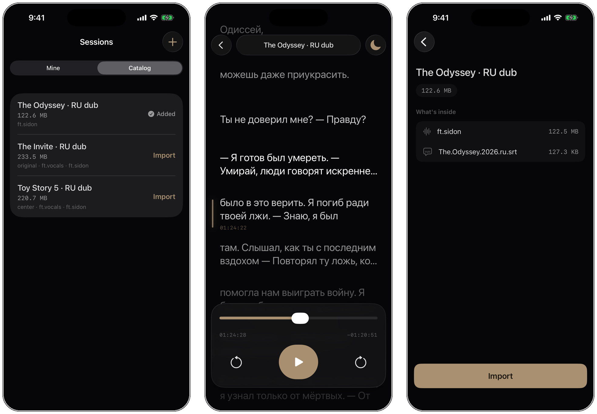
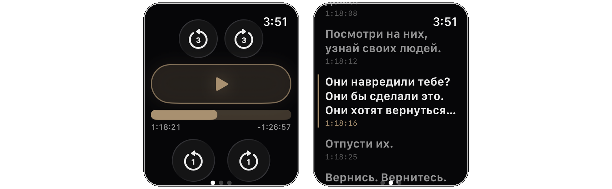

# Allspeak

Single-user iOS app for cinema-goers who watch films in languages they
don't fully understand. Prepare a "session" by attaching a pre-extracted
original-language audio file (`.m4a`) and a subtitle file (`.srt`). In the
cinema, listen to the original audio through one AirPod while the on-screen
scrolling subtitle window acts as a visual sync anchor. Tapping any subtitle
line seeks the audio to that line's timestamp.

The in-cinema experience is fully offline; the only online path is the optional
Catalog for pulling prepared sessions onto the phone (see below). No manual
offset entry, no calibration, no accounts, no onboarding, no settings.

<p align="center">
  
</p>
<p align="center">
  <em>Browse the catalog&nbsp;&nbsp;·&nbsp;&nbsp;Watch with the subtitle river&nbsp;&nbsp;·&nbsp;&nbsp;See what's inside</em>
</p>

## Try it

Allspeak is in private TestFlight beta. Want a build? Reach out and I'll add you
as a tester - direct invite, no App Store review.

- **Ping me:** [Telegram @pkarpovich](https://t.me/pkarpovich) or [pavel.karpovich@outlook.com](mailto:pavel.karpovich@outlook.com)
- I'll need the **Apple ID email** for your TestFlight invite - send it privately,
  not in a public issue.

Requires an iPhone on iOS 26+ (Apple Watch on watchOS 26+ optional, for the
remote). Everything below is for building from source.

## Requirements

- macOS with Xcode 26+
- iOS 26+ target (device or simulator)
- [XcodeGen](https://github.com/yonaskolb/XcodeGen) — `brew install xcodegen`

## Build

```fish
xcodegen generate
open Allspeak.xcodeproj
```

Then in Xcode: pick the `Allspeak` scheme, choose a destination, and build /
run. There are no third-party Swift packages; all dependencies are system
frameworks (SwiftUI, AVFoundation, CoreData, WatchConnectivity, ShazamKit).

## Preparing files

The MVP does not bundle audio extraction. You supply the `.m4a` and `.srt`
pair yourself (e.g. via a Mac-side script that strips them from an MKV
source) and transfer them to the iPhone through the Files app, AirDrop, or
iCloud Drive. Inside Allspeak:

1. Tap `+` on the Sessions screen.
2. Name the session (e.g. `After the Light · 21:30`).
3. Tap `Choose audio files` and pick one or more `.m4a` files via the
   system file picker. Each file becomes a separate audio track on the
   session (e.g. `loudnorm-only`, `demucs+loudnorm`, `DFN v3`, or a
   different dubbing studio). Label each picked file before saving — the
   first track becomes the default.
4. Tap `Choose subtitles file` and pick the `.srt`. The subtitle timeline
   is shared across all tracks in the session.
5. Save.

Picked files are copied into the app's Documents container at
`Documents/sessions/<uuid>/track-<trackID>-<filename>` (one per track)
plus a single subtitles file, and are independent of the original source
location after import. To add more tracks to an existing session (e.g.
drop in a new dub when it becomes available), use the `Tracks` action in
the session row's context menu.

### Audio prep pipeline (`scripts/bifrost.fish`)

The `.m4a` voice track is produced by `scripts/bifrost.fish` (fish, macOS):
decode, optional FPS retime, Demucs vocal separation, Sidon speech
restoration, then loudnorm. See the header comment in the script for full
usage.

Demucs runs on the Apple Silicon GPU via the
[`demucs-mlx`](https://github.com/ssmall256/demucs-mlx) port (base `htdemucs`),
roughly 20x faster than the old CPU path (~7 min vs ~3h for a 2h film). Base
`htdemucs` is used rather than `htdemucs_ft`: the 4-model `_ft` ensemble is far
heavier on this GPU for a quality difference that is inaudible after Sidon
restoration on cam sources. Two pins are REQUIRED:

- `mlx-audio-io==1.3.10` holds `mlx` at `0.31.0`; `mlx` `0.31.2` made GPU streams
  thread-local and crashes the port with `There is no Stream(gpu, 1) in current
  thread` (upstream regression,
  [ml-explore/mlx-lm#1179](https://github.com/ml-explore/mlx-lm/issues/1179)).
  Drop it only once `demucs-mlx` runs on `mlx >= 0.31.2`.
- the `[convert]` extra converts `htdemucs`'s weights to MLX on first run (cached
  in `~/.cache/demucs-mlx/`); only `htdemucs_ft` ships pre-converted weights.

The port writes all four stems to `<out>/<track>/vocals.wav` (no per-model
subdir), so the script resolves the vocals path with `find`. Sidon stays on CPU
(~25 min for a 2h film): its checkpoints are CUDA-traced TorchScript with float64,
which Apple's MPS backend does not support.

### Switching tracks at runtime

In `PlayerView`, a toolbar `Menu` appears when a session has more than one
track. Tapping it lists every track with a checkmark on the active one;
selecting another switches the playing audio while preserving the current
position (~100-300ms gap during reload, no crossfade). The same list lives
on the Apple Watch as its own TabView page - see below.

### Resyncing in the cinema

When the dub drifts from the screen, tap the subtitle line currently showing -
on the phone's scrolling subtitle window or in the watch's cue list - and the
audio seeks to that line's timestamp. The skip controls cover the fine
adjustment from there - ±0.5s on the phone's player, ±3s / ±1s on the watch
transport. Sessions that carry a fingerprint can also resync from the hall's
sound, see below.

### Cinema listen

A catalog session can carry an optional ShazamKit fingerprint (a
`.shazamcatalog` built on the Mac from the music and effects of the same RU
track, in 600 s chunks with 30 s overlap; each chunk's media item has
`subtitle = "abs_start=<seconds>"`). When it does, the watch shows a `Слушать`
page right after the transport page. There is no listening UI on the phone and
no automatic or background listening.

- One tap on `Слушать` starts two independent listeners at once: the phone's
  built-in mic and the watch mic. The page shows a status line per source
  (`Телефон: слушаю 0:23`, `Часы: нет совпадения`, `прервано`, `ошибка: ...`),
  a `Стоп` button, and a hint to keep the wrist raised.
- The first match from either source shows a card with the offset
  (`+2.4 с`), the source, and `Применить` / `Отмена`, with a click haptic. The
  watch computes the offset as `(trackTime + (now - matchDate)) - position`,
  where `trackTime = abs_start + predictedCurrentMatchOffset`.
- `Применить` stops both listeners, shows `Готово`, and sends
  `applySync(trackTime:matchDate:source:)`. The phone seeks to
  `trackTime + (now - matchDate) + outputLatency` with the `sync` source.
- Each listener stops on its first match, after 120 s, or on `Стоп`. The watch
  listener (`SHManagedSession`) also stops as `interrupted` when the watch app
  leaves the active phase (wrist down); the phone listener stops as
  `interrupted` when an audio interruption (a call, Siri) begins.
- A phone result that arrives while the watch is unreachable (wrist down) is
  held on the phone and re-sent when the watch becomes reachable again. If the
  phone never answers, the watch marks it `нет совпадения` 15 s after the
  phone's own timeout. If `Применить` cannot reach the phone, the card returns
  so it can be retried.
- Both apps ask for microphone access the first time `Слушать` is tapped. The
  phone is usually locked in a pocket at that point, so do the first tap at
  home with Allspeak open on the phone and grant both prompts. A refused
  permission shows as `ошибка: mic permission` for that source.
- The phone listener uses `SHSession` with its own `AVAudioEngine` input tap.
  While listening the audio session is `.playAndRecord` / `.default` with
  options exactly `[.allowBluetoothA2DP]` and the built-in mic as preferred
  input, so AirPods keep playing over A2DP instead of switching to the HFP mic.
  The player keeps playing, and `.playback` / `.spokenAudio` is restored
  afterwards.
- The watch pulls the fingerprint from the phone in ~30 KB `sendMessage` chunks
  (`requestFingerprintChunk(sha256:index:)`, like the cue bundle) and keeps
  only the latest file in Application Support, keyed by sha256.
- Both sources write `listen` events to the phone's diagnostics log (the watch
  reports its phases to the phone), so the logs show which mic matches better.

### Session diagnostics

Playing any session writes a per-screening JSONL log to
`Documents/diagnostics/` (pulled via the Files app) for after-the-fact analysis
on the Mac. It is always on and has no setting. Every line carries `ts` and
`event`. Every event except `session` records the track position in track
seconds: `pos`, or `from` / `to` for skips and `from` for seeks. Booleans are
written as `1` / `0`. Event types:

- `session` - first line: session, title, track (id, label, file, SHA), catalog
  id and revision, the session's saved hall (`hall`, `hallName`), app version,
  build, device and OS.
- `play` / `pause` - user transport.
- `skip` - `seconds` and `source` (phone or watch), position before and after.
- `seek` - target `time`, `source` (phone, watch, or `sync` for an applied
  cinema-listen match), position before, and the subtitle `cue` index when the
  seek came from tapping a line.
- `track` - track switch.
- `tick` - every 30 s while a session is open: position, `playing`, audio
  route and output latency.
- `route` - audio route change with its reason.
- `interruption` - audio interruption began / ended.
- `app` - app moved to background / back to foreground (only while a session
  is open).
- `watch` - watch reachability change, `reachable` (only while a session is
  open).
- `hall` - cinema hall picked in the player.
- `listen` - a cinema-listen phase: `source` (phone or watch), `phase`
  (`start`, `match`, `nomatch`, `timeout`, `cancel`, `interrupted`, `failed`,
  `apply`), `listenSec`, and `error` on failure. A match adds `trackTime`, the
  matched `chunk` start, `delta` against the current position and the output
  `latency`; `apply` adds `elapsed` since the match and the seek `target`.

The player's title capsule is a menu with the Cinema City Łódź Manufaktura hall
list (IMAX, Sala 1-14). The hall is saved on the session, so it can be picked
at home before going to the cinema: every later log of that session carries it
in the `session` header, and the hall name shows under the title. Changing it
logs a `hall` event.

Logs older than 365 days are deleted when the next session starts.

## Catalog (online session distribution)

Sessions prepared on the Mac no longer have to reach the phone over AirDrop.
The Mac uploads a session once to the personal catalog backend
(`https://allspeak.pkarpovich.dev`), and the phone imports it from anywhere -
LTE on the way to the cinema included.

The Sessions screen carries a `Mine` / `Catalog` segmented control below the
large title. `Mine` (the default) is the usual list of local sessions; `Catalog`
lists the sessions published to the backend, newest first, each row showing the
title, total download size, and track labels.

### Importing from the catalog

1. Switch to the `Catalog` segment. Rows fetch on appear; a fetch failure shows
   a plain inline error with a `Retry` button.
2. Tap a row for the detail screen (title, size, a `What's inside` list of every
   audio track with its size, plus the subtitle row) or tap `Import` directly on
   the row.
3. Import downloads all files (audio tracks + `.srt`) from Cloudflare R2 via
   short-lived presigned URLs, then creates a regular local session through the
   same `importMultiTrackSession` pipeline used for manual imports - an imported
   session is indistinguishable from a hand-made one and appears under `Mine`
   with its tracks (the server's default track pre-selected) and subtitles.
   When the server lists an optional `fingerprint` (the ShazamKit catalog used
   by cinema listen), it is downloaded too and stored in the session directory
   as `fingerprint-<sha>-<name>`; sessions without one import as before.
4. Downloads run inside a `BGContinuedProcessingTask`: locking the phone
   mid-download does not stop it, and the system shows a progress card. Files are
   staged and sha256-verified one at a time under `Application Support`, so a
   download interrupted by lock, expiry, or a killed app resumes by skipping the
   files already verified on the next `Import` tap.

### Staying in sync

Each imported session records the server `id`, `revision`, and per-file sha256
hashes in a sidecar `server.json` inside the session directory (invisible to the
rest of the app, deleted with the session folder - no Core Data schema change).

`Mine` rows for catalog-linked sessions show a `Catalog · v<revision>` badge.
When the last catalog fetch reports a higher revision, that row gains an `Update`
button and an `N updates available` banner appears above the list (no background
polling - the state derives from the store's last fetch). Tapping `Update` opens
a sync sheet that shows, per file, whether it `changed` or is the `same`, plus
the total download size. Applying the sync downloads **only** the changed files
and reconciles the local session with existing repository mutations (add / remove
track, replace subtitle, rename), preserving the current playback position.
The fingerprint is diffed like any other file, so a revision that only adds or
changes it downloads just the fingerprint.

### Build-time config (the iOS ".env")

The backend URL and read token are baked in at build time via an xcconfig, the
same pattern used for signing. For a fresh checkout:

```fish
cp Allspeak/CatalogConfig.xcconfig.example Allspeak/CatalogConfig.xcconfig
# then edit Allspeak/CatalogConfig.xcconfig:
#   ALLSPEAK_CATALOG_URL       = https://allspeak.pkarpovich.dev
#   ALLSPEAK_CATALOG_READ_TOKEN = <your read token>
```

`Allspeak/CatalogConfig.xcconfig` is git-ignored; `Signing.xcconfig` pulls it in
with `#include? "CatalogConfig.xcconfig"` (optional - an absent file does not
break the build, and undefined settings substitute as empty strings, so CI and
first-run builds still compile). The two values flow into `Info.plist`
(`AllspeakCatalogURL` / `AllspeakCatalogReadToken`) and are read by
`CatalogConfig`. On push to `main`,
`.github/workflows/deploy-testflight.yml` writes the real `CatalogConfig.xcconfig`
from the `ALLSPEAK_CATALOG_URL` / `ALLSPEAK_CATALOG_READ_TOKEN` GitHub secrets.

## Apple Watch remote

Allspeak ships with a companion watchOS app (`AllspeakWatch`) that lets you
resync subtitles in a cinema without taking the iPhone out of your pocket.
The watch is a thin remote: it sends commands (play/pause, skip ±1s / ±3s,
seek-to-cue, set volume, start / stop cinema listen) to the iPhone, which
remains the audio host. During cinema listen the watch also runs its own mic
listener as a second source.

<p align="center">
  
</p>
<p align="center">
  <em>Transport controls&nbsp;&nbsp;·&nbsp;&nbsp;Tap a line to seek</em>
</p>

### Pairing

1. Pair the Apple Watch with the test iPhone via the iOS `Watch` app
   (Settings → Watch).
2. Install both builds — the watch app installs automatically alongside the
   iPhone app once the bundle reaches the device (TestFlight, Xcode, or
   ad-hoc).
3. Foreground both apps at least once after install. WatchConnectivity
   requires both peers to have been launched by the user before delivery
   starts working.
4. Open a session on the iPhone. The watch will receive the session
   metadata via `updateApplicationContext` and pull the full cue bundle in
   ~30 KB gzipped `sendMessage` chunks (cached on-watch for restart
   resilience).

### Usage

- **Page 1** (default, transport): a stacked transport layout — a centered
  pair of ±3s coarse skips on top, a full-width Play/Pause, a non-interactive
  film progress bar (gold fill with the elapsed time on the left and a remaining
  countdown on the right, self-advancing while playing - 1 Hz with the wrist
  raised, stepping once per minute in the Always-On Display so it never freezes
  mid-film with the wrist down), and a centered pair of ±1s fine skips
  beneath. Both skip rows are bare two-button pairs — no center element. The
  skip controls are circular glass buttons whose icon is a
  curved arrow with the interval inside it (`3`, `1`); every skip tap plays a
  click haptic. Play/Pause is a warm-tinted glowing pill. The Digital Crown
  drives the phone's real system output volume (re-synced from the phone's
  reported `outputVolume` while the Crown is idle) with haptic ticks at each
  detent; the native Crown indicator fills with loudness so a full bar = max
  volume. As a consequence of the system locking fill direction to rotation
  direction, turning the Crown **down** raises the volume. Rapid rotation
  coalesces into a single trailing-edge command.
- **Listen page** (swipe up, only when the session has a fingerprint):
  `Слушать` resyncs from the hall's sound, see
  [Cinema listen](#cinema-listen).
- **Cue list** (swipe up): scrollable list of all cues with the current line
  highlighted; tap any line to seek the iPhone audio to that timestamp.
- **Track list** (swipe up again): list of audio tracks on the current
  session, with a checkmark on the active one. Tap any track to switch
  the iPhone-side audio. Shows a `Single track` placeholder when the
  session has only one track.
- Rapid skip taps (fine or coarse) coalesce inside a 250ms window so five
  quick ±1s taps send a single `skip(+5)` command rather than five
  round-trips; mixed fine + coarse taps sum in the same window.
- Between authoritative snapshots from the iPhone, the watch interpolates
  the displayed position locally (`currentTime + (now - serverDate)` while
  playing) so the UI never feels frozen. The progress readout re-anchors from
  whichever source has the newer `serverDate` - the live `sendMessage` snapshot
  or the latest-wins `SessionMetadata` application context (which now carries
  its own `serverDate` anchor, refreshed on every playback state change). That
  context is delivered in the background, so even after the watch has been
  unreachable for a stretch (phone in pocket, screen off), the next wrist-down
  Always-On redraw re-anchors to the freshest position rather than freezing.

The commands round-tripped over WatchConnectivity are: `play`, `pause`,
`togglePlayPause`, `skip(seconds:)`, `seek(time:)`, `switchTrack(id:)`,
`setVolume(_:)`, `requestCueChunk(sessionID:revision:index:)`, and for cinema
listen `requestFingerprintChunk(sha256:index:)`, `startListening`,
`cancelListening`, `listenEvent(_:)` and `applySync(trackTime:matchDate:source:)`.
Session metadata delivered to the watch carries a `tracks: [TrackInfo]` array,
the current `activeTrackID`, an optional `serverDate` playback anchor, and
optional `fingerprintSHA` / `fingerprintSize` (all decoded with
`decodeIfPresent`, so an older phone build still decodes). The
wire contract lives in
`Allspeak/Watch/WireProtocol.swift` — see the header comment there for
the protocol summary.

## Architecture

- **UI**: SwiftUI, dark-only, single device family (iPhone, portrait).
  Liquid Glass surfaces use iOS 26's `.glassEffect()` with warm-tint overlays
  per the design's chrome / plate variants.
- **Persistence**: Core Data with `Session` and `AudioTrack` entities
  (one-to-many, cascade delete). Persistent history tracking is enabled;
  lightweight migration carries pre-multitrack sessions forward by
  back-filling a single `AudioTrack(label: "Original", isDefault: true)`
  from the legacy `Session.audioFilename` field. The current model version is
  `Allspeak v6`, which adds the optional `Session.hallKey` (the cinema hall
  saved for diagnostics). v5 dropped the two optional `Session` fields that
  carried the removed cinema-sync files (`catalogFilename`, added in v3, and
  `dtwMapFilename`, added in v4). Every migration in the chain is lightweight
  and inferred, so a store written by any earlier build opens in place with its
  sessions intact. File payloads (audio + srt) are not stored in Core Data —
  only filenames.
- **Audio**: Single `AVAudioPlayer` per player session, `.playback` category,
  `.spokenAudio` mode. Background audio is permitted via the `audio` entry in
  `UIBackgroundModes`. While cinema listen runs, the category is temporarily
  `.playAndRecord` with a separate `AVAudioEngine` input tap, and `.playback` /
  `.spokenAudio` is restored afterwards (see Cinema listen).
- **Now Playing**: Lock-screen and Control Center integration via
  `MPNowPlayingInfoCenter` (metadata + elapsed time) and
  `MPRemoteCommandCenter` (play/pause, ±15s skip, scrub). The card and
  remote-command transport (lock screen, Control Center, AirPods stem,
  external Bluetooth remotes) are driven by the same `AudioController`
  state — there is no separate playback path.
- **SRT parsing**: pure Swift, parsed on demand when entering the player.
- **Design tokens**: all colors, fonts, and glyphs live in
  `Allspeak/Design/{Tokens,Glass,Icons}.swift`. No inline hex outside
  `Tokens.swift`.

## Testing

Tests use [Swift Testing](https://developer.apple.com/documentation/testing)
(`@Test`, `#expect`, `#require`), not XCTest. Run from Xcode (`⌘U`) or:

```fish
xcodebuild test -scheme Allspeak \
  -destination 'platform=iOS Simulator,name=iPhone 17 Pro'
```

Suites are tagged (`.parser`, `.coreData`, `.storage`, `.audio`, `.catalog`)
so subsets can be run with the `--filter` flag.

## Commit messages

[Conventional Commits](https://www.conventionalcommits.org/) — `feat:`,
`fix:`, `refactor:`, `docs:`, `test:`, `chore:`.
